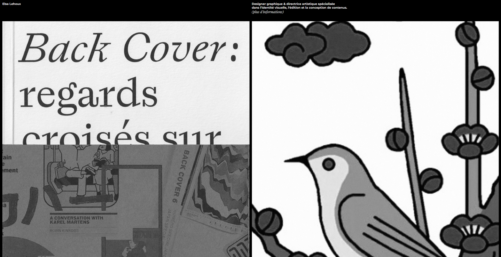

# Portfolio Website – Elsa Lehoux

[]()

FRENCH WEBSITE – A minimalist, elegant, and responsive portfolio showcasing illustration and graphic design work. Built using HTML and CSS.

## ✨ Features

- **Artwork Presentation:** Display of projects with detailed visuals and descriptions.
- **Responsive Design:** Fully adapted for desktops, tablets, and mobile devices.
- **Smooth Navigation:** Simple structure with anchor links for quick access.
- **Gallery and Project Pages:** Visual focus on design work in a clean layout.
- **Lightweight and Fast:** No framework dependency – pure HTML/CSS stack.

## 🛠️ Technologies Used

- **Frontend:**
  - HTML5
  - CSS3
- **Other:**
  - Git for version control
  - Responsive meta tags for mobile optimization

## 💻 Installation

1. **Clone the repository:**

   ```bash
   git clone https://github.com/Antoinekoe/elsalehoux.git
   cd elsalehoux
   ```

2. **Open the project in your browser:**

   You can use a local server like Live Server (VS Code extension), or simply open `index.html` in your preferred browser.

## 🗂️ Project Structure

```
elsalehoux.fr/
├── fonts/          # Typo file
├── img/             # Images file
├── annee-2005.css
├── annee-2005.html
├── atna.css
├── atna.html
├── back-cover.css
├── back-cover.html
├── chanoyu-protocole.css
├── chanoyu-protocole.html
├── collection-philein.css
├── collection-philein.html
├── composite-4.css
├── composite-4.html
├── ecrire-geste.css
├── ecrire-geste.html
├── hanafuda.css
├── hanafuda.html
├── index.html
├── informations.css
├── informations.html
├── la-planche.css
├── la-planche.html
├── LICENSE       # License file
├── long-story.css
├── long-story.html
├── macval.css
├── macval.html
├── README.md     # README file
├── st-denis.css
├── st-denis.html
└── style.css
```

## 🤝 How to Contribute

Although this is a personal portfolio, feel free to submit suggestions or open issues for improvements. To contribute:

1. **Fork the repository.**
2. **Create a branch:**

   ```bash
   git checkout -b improvement/your-suggestion
   ```

3. **Make your changes, then push them:**

   ```bash
   git push origin improvement/your-suggestion
   ```

4. **Open a pull request for review.**

## 🔑 License

This project is licensed under the MIT License. See the LICENSE file for more details.
